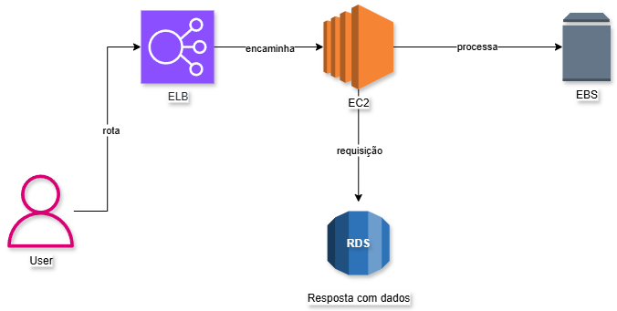

# 🚀 Arquiteturas AWS - Desafio prático

Este repositório contém dois diagramas de arquiteturas AWS desenvolvidos no **Draw.io (diagrams.net)**.  
O objetivo foi demonstrar na prática o funcionamento de diferentes combinações de serviços na nuvem e documentar o aprendizado de forma clara e acessível.  

---

## 📌 Sobre o Desafio
Criar diagramas que representem duas abordagens arquiteturais na AWS:

1. **Serverless (S3 + Lambda + CloudWatch)** → solução escalável e orientada a eventos.  
2. **Tradicional (EC2 + EBS + RDS + ELB + CloudWatch)** → aplicação baseada em instâncias e armazenamento persistente.  

Cada arquitetura foi ilustrada, documentada e acompanhada de reflexões sobre seu uso no mundo real.

---

## 🖼️ Arquiteturas

### 1️⃣ Serverless: S3 + Lambda
- **S3**: Armazenamento de objetos.  
- **Lambda**: Execução de funções sob demanda.  
- **CloudWatch**: Monitoramento e logs.  

Fluxo: Usuário → Upload no S3 → Disparo automático de função Lambda → Monitoramento pelo CloudWatch  

---

### 2️⃣ Tradicional: EC2 + EBS + RDS + ELB
- **ELB**: Balanceamento de carga.  
- **EC2**: Servidores virtuais para aplicação.  
- **EBS**: Armazenamento de blocos persistente.  
- **RDS**: Banco de dados relacional.  
- **CloudWatch**: Observabilidade da aplicação.  

Fluxo: Usuário → ELB → EC2 → EBS/RDS → Resposta → Logs no CloudWatch  

---

## 🛠️ Ferramentas Utilizadas
- [Draw.io](https://app.diagrams.net/) para modelagem das arquiteturas  
- Git & GitHub para versionamento e compartilhamento  
- Markdown para documentação  

---

## 💡 Aprendizados
- Compreensão das diferenças entre arquiteturas **serverless** e **tradicionais**.  
- Visualização prática de como serviços da AWS se conectam.  
- Experiência em documentar projetos técnicos de forma organizada e clara.  

---

## 📂 Estrutura do Repositório
/
├── README.md -> Documentação principal
├── images/ -> Capturas dos diagramas
│ ├── arquitetura1.png
│ └── arquitetura2.png
└── desafio.drawio -> Arquivo editável

---

## ✨ Sobre mim
Sou desenvolvedora web full stack com foco em **soluções escaláveis** e **boas práticas de arquitetura**.  
Esse desafio reforçou meu interesse em **cloud computing** e em aplicar AWS como base para projetos robustos e modernos.  

🔗 Vamos nos conectar no [LinkedIn](https://www.linkedin.com/in/annykarolinedecarvalhomartins/)  
