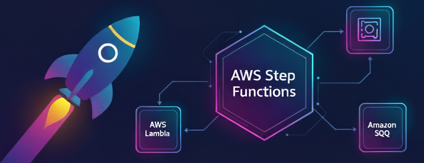
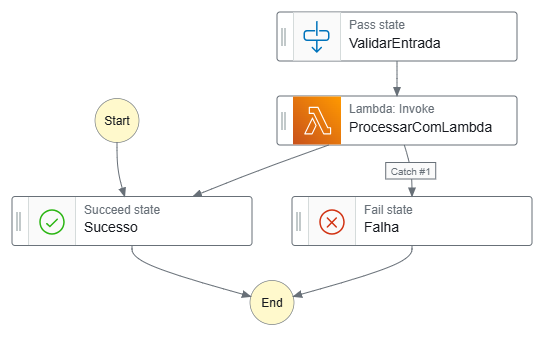
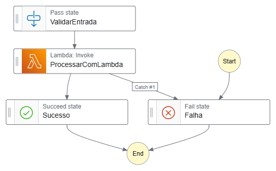

  
 
# Desafio AWS Step Functions – Bootcamp Santander Code Girls 2025
*Explorando workflows serverless com AWS Step Functions e AWS Lambda*

---

## 🌟 Sobre o Projeto
Este repositório documenta minha **jornada prática** no Bootcamp Santander Code Girls 2025, onde explorei:

- ⚡ Orquestração de workflows serverless  
- 🛠️ Tratamento de erros e monitoramento com AWS Step Functions  
- 💡 Integração prática com AWS Lambda  
- 📄 Criação de **state machines simples e eficientes**

> Tudo feito em **conta AWS Free Tier**, garantindo zero custos.  

---

## 📚 Conceitos Aprendidos

### 1️⃣ O Que São Step Functions?
- Serviço **serverless** que coordena **workflows distribuídos** usando **Amazon States Language (ASL)** (JSON).  
- **Benefícios:**
  - Visualização gráfica de fluxos
  - Integração nativa com Lambda, SNS, DynamoDB
  - Tratamento automático de erros e paralelismo

- **Tipos de Workflows:**  
  - **Standard:** Longos e duráveis  
  - **Express:** Rápidos, de alto volume

---

### 2️⃣ Componentes Principais
- **Estados (States):**
  - 🔹 **Pass:** Manipula dados sem executar tarefas externas  
  - 🔹 **Task:** Executa ações, como chamar uma Lambda  
  - 🔹 **Succeed / Fail:** Estados finais de sucesso ou falha  
  - 🔹 **Choice:** Ramificações condicionais  

- **Execuções:** Iniciadas via Console, API ou SDK. Monitoradas com **CloudWatch** e **X-Ray**.  
- **Roles IAM:** Garantem permissões seguras, como `lambda:Invoke`.  

---

### 3️⃣ Boas Práticas
> 💡 Dicas importantes:

- ✅ Validar JSON **ASL** antes de criar a state machine  
- ✅ Implementar **Retry** e **Catch** para resiliência  
- ✅ Monitorar execuções para não ultrapassar limites do **Free Tier** (4.000 execuções/mês gratuitas)  

---

## 🛠 Hands-On: Meu Workflow de Exemplo

Nome da state machine: `workflow-exemplo-limpo`  
Objetivo: Simular um processo de **validação e processamento** de dados.

Fluxo do workflow:

1. **ValidarEntrada (Pass)** – Adiciona mensagem e mantém input  
2. **ProcessarComLambda (Task)** – Chama uma Lambda, com **Retry** e **Catch**  
3. **Sucesso (Succeed)** – Workflow concluído com output da Lambda  
4. **Falha (Fail)** – Captura erros e finaliza workflow

> 🔗 Código completo disponível: [workflow-exemplo.json](workflow-exemplo.json)

---

## Visualização do Workflow

### Diagrama do Workflow

### Estado de Sucesso

### Estado de Falha

---

## Próximos Passos / Ideias Futuras
- ➕ Adicionar **Choice states** para decisões condicionais  
- 🔀 Criar workflows mais **complexos e paralelos**  
- 💾 Integrar com **DynamoDB e SNS**  
- ⚡ Explorar **Step Functions Express** para alto volume  

---

## Dicas Pessoais
> Para melhor compreensão do workflow:

- Sempre visualize no console AWS para entender cada execução  
- Teste **inputs variados** para reforçar o tratamento de erros  
- Documente cada state para facilitar manutenção futura  

---

## 🏅 Badges e Reconhecimentos
  
  

---

## 📌 Contato
Quer trocar ideias ou tirar dúvidas?  
- **LinkedIn:** [Anny Karoline](https://www.linkedin.com/in/annykarolinedecarvalhomartins/)  
- **Email:** annykamartins@icloud.com

---

> Obrigada por conferir meu projeto! 🙌
