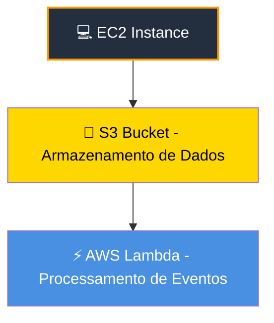
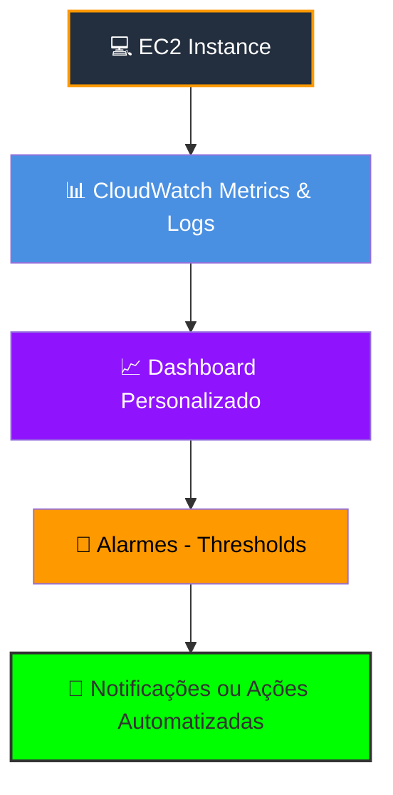

# Módulo 2 – Computação na Nuvem com EC2 e Armazenamento

## 📌 Resumo
Este módulo apresenta os conceitos de **Amazon EC2**, tipos de instâncias, otimização de recursos e os principais serviços de armazenamento na nuvem, como **Amazon EBS** e **Amazon S3**. Inclui um desafio de arquitetura para consolidar o aprendizado.

---

## 🖥️ Amazon EC2 – Entendendo Instâncias

- **O que é EC2**: Serviço de servidores virtuais escaláveis na nuvem (Elastic Compute Cloud). Permite criar máquinas virtuais com sistemas operacionais diferentes e configuráveis.  
- **Tipos de Instâncias**:
  - **T2/T3** → Balanceadas, para uso geral  
  - **M5** → Computação média, memória equilibrada  
  - **C5** → Computação otimizada, para processamento intenso  
  - **R5** → Memória otimizada, ideal para bancos de dados em memória  
- **Otimização de recursos**:
  - Escolher instância adequada à carga evita custos desnecessários  
  - Utilizar **Auto Scaling** para ajustar recursos conforme demanda

---

## 💾 Armazenamento na Nuvem

- **Amazon EBS (Elastic Block Store)** → Discos virtuais para EC2.  
  - Tipos: SSD (GP2/GP3), HDD (ST1/SC1)  
  - Persistente: dados não se perdem quando instância é desligada  
- **Amazon S3 (Simple Storage Service)** → Armazenamento de objetos escalável, ótimo para arquivos, backups e sites estáticos.  
  - Classes de armazenamento: Standard, Infrequent Access, Glacier (arquivamento)  
  - Exemplo: armazenar imagens, logs, backups  

---

## 🏗️ Desafio de Arquitetura

### Arquitetura EC2 → S3 → Lambda

> ✅ Explicação: EC2 envia/processa dados → S3 armazena → Lambda processa eventos automaticamente.  

---

### **2️⃣ EC2 Dashboard no CloudWatch**

### EC2 Dashboard - Monitoramento

> ✅ Explicação: EC2 envia métricas para CloudWatch → Dashboard consolida → Alarmes monitoram thresholds → Notificações ou ações automatizadas.

