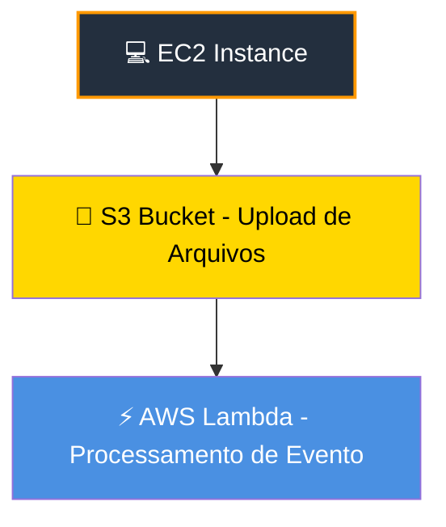
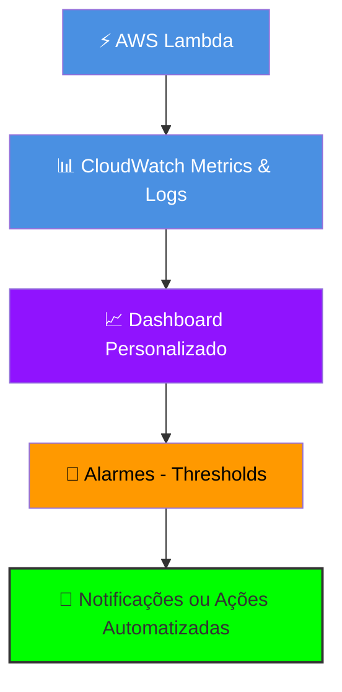

# Módulo 3 – Criando Recursos na AWS

## Resumo
Neste módulo, aprendemos a criar **instâncias EC2**, **buckets S3** e **funções Lambda**. Também exploramos a diferença entre EC2 e Lambda (serverless) e como configurar o acesso remoto com MobaXterm.  

---

## 🖥️ Criando sua Primeira Instância Amazon EC2

- **O que é EC2**: Servidores virtuais escaláveis  
- **Criação passo a passo**:
  1. Escolher AMI (Linux ou Windows)  
  2. Selecionar tipo de instância (ex.: t2.micro para testes)  
  3. Configurar storage e Security Group  
  4. Lançar instância e conectar via SSH (Linux) ou RDP (Windows)  
- **Acesso local com MobaXterm**:
  - SSH para Linux: `ssh -i chave.pem ec2-user@ip-da-instancia`  
  - RDP para Windows: usar usuário e senha fornecidos no launch  

- **Comparação EC2 Linux x Windows**:
  - Linux: comandos via terminal, mais leve e flexível  
  - Windows: interface gráfica, fácil para quem conhece Windows  

---

## 🪣 Criando seu Primeiro Bucket no Amazon S3

- **Planejamento**:
  - Nome único global  
  - Escolher região  
  - Definir permissões (privado ou público)  
- **Criação prática**:
  - Upload de arquivos de teste  
  - Configurar políticas de versão, criptografia e lifecycle  
- **Exercício prático**: criar bucket, subir arquivos e configurar política de acesso  

---

## Criando sua Primeira Função AWS Lambda

- **Serverless**: execução de código sem gerenciar servidores  
- **Diferença EC2 x Lambda**:
  - EC2: servidor ligado, você gerencia SO e updates  
  - Lambda: roda somente quando acionado, paga pelo tempo de execução  
- **Hello World Lambda**:
  1. Criar função Lambda no console  
  2. Escolher runtime (ex.: Python 3.9)  
  3. Inserir código simples: `def lambda_handler(event, context): return "Hello World"`  
  4. Testar com evento de teste  

## 🏗️ Diagrama – Fluxo EC2 → S3 → Lambda

> ✅ Explicação: EC2 envia dados para S3 → S3 gera evento de criação → Lambda processa automaticamente.

## 🏗️ Diagrama – Lambda Dashboard no CloudWatch

> ✅ Explicação: Lambda envia métricas e logs → Dashboard consolida → Alarmes monitoram thresholds → Notificações ou ações automatizadas.
