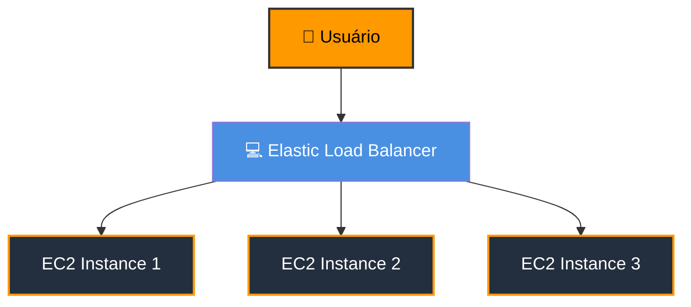
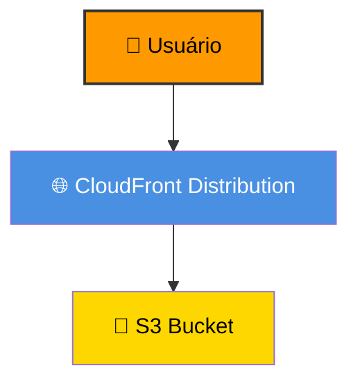
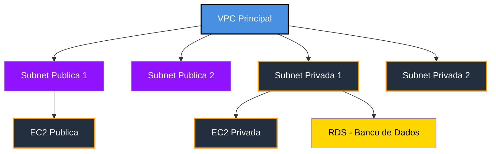

# Módulo 4 – Redes na AWS

## 📌 Resumo
Este módulo apresenta os conceitos de **VPC**, **subnets**, **security groups**, **Route 53**, **CloudFront** e **Elastic Load Balancer (ELB)**. São fundamentos essenciais para arquitetar aplicações seguras, escaláveis e com alta disponibilidade na nuvem.

---

## 🌐 Amazon VPC (Virtual Private Cloud)

- **O que é VPC**: Rede virtual privada dentro da AWS, isolada de outras redes.  
- **Objetivo**: Permitir controle total sobre endereçamento IP, subnets, roteamento e segurança.  
- **Exemplo**: Criar VPC `10.0.0.0/16` com duas subnets públicas (`10.0.1.0/24`) e privadas (`10.0.2.0/24`).

---

## 🏘️ Subnets

- **O que é Subnet**: Divisão da VPC em redes menores, podendo ser públicas ou privadas.  
- **Uso**:
  - Pública: EC2 que precisa acessar a internet  
  - Privada: Banco de dados ou serviços internos sem exposição direta à internet  

---

## 🔐 Security Groups

- **O que é Security Group**: Firewall virtual que controla o tráfego de entrada e saída da instância EC2 ou outros serviços.  
- **Exemplo**:
  - Porta 22 (SSH) aberta apenas para seu IP  
  - Porta 80 (HTTP) aberta para qualquer lugar  

---

## 🌍 Route 53

- **O que é**: Serviço de DNS da AWS.  
- **Função**: Traduz domínios (ex.: `meusite.com`) em endereços IP de instâncias ou serviços.  
- **Exemplo**: Apontar `www.bootcampcodegirls.com` para EC2 ou S3 static website.

---

## ☁️ Amazon CloudFront

- **O que é**: CDN (Content Delivery Network) da AWS para distribuição de conteúdo global.  
- **Benefício**: Reduz latência, melhora performance e aumenta disponibilidade do conteúdo.  
- **Exemplo**: Distribuir arquivos estáticos de S3 para usuários no mundo inteiro.

---

## ⚖️ Elastic Load Balancer (ELB)

- **O que é**: Serviço que distribui automaticamente tráfego de entrada entre múltiplas instâncias EC2.  
- **Tipos de Load Balancer**:
  - **ALB (Application Load Balancer)** → camada 7, roteamento baseado em URL e conteúdo  
  - **NLB (Network Load Balancer)** → camada 4, alto desempenho e baixa latência  
  - **CLB (Classic Load Balancer)** → mais antigo, menos usado hoje  
- **Exemplo**: 2 instâncias EC2 atrás de um ALB para suportar alta demanda de usuários  

## 🏗️ Arquitetura ELB + EC2

> ✅ Explicação: Usuários acessam o ELB, que distribui requisições entre múltiplas instâncias EC2.

## 🏗️ Arquitetura + S3

> ✅ Explicação: Usuários acessam o conteúdo via CloudFront → CloudFront busca objetos no S3 Bucket → entrega conteúdo rápido globalmente.  

## 🏗️ ️Arquitetura VPC + Subnets

> ✅ Explicação: Estrutura de rede da VPC com subnets públicas/privadas; instâncias públicas acessíveis da internet e privadas isoladas; banco de dados RDS na subnet privada.  

