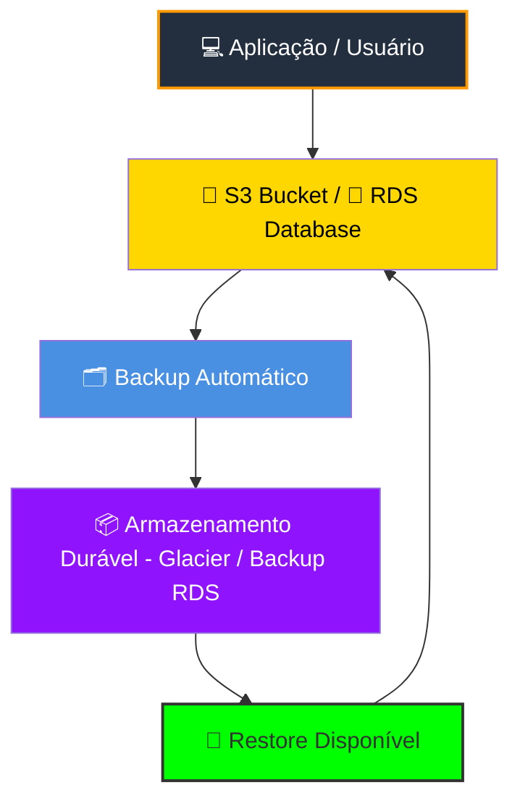
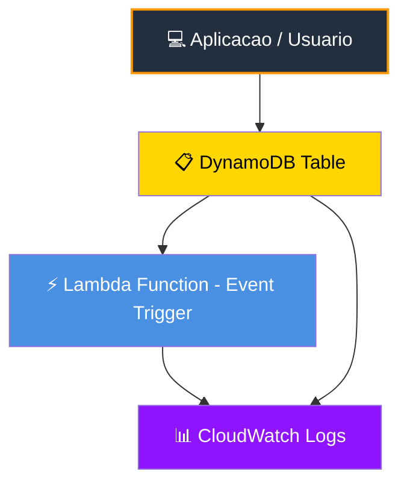
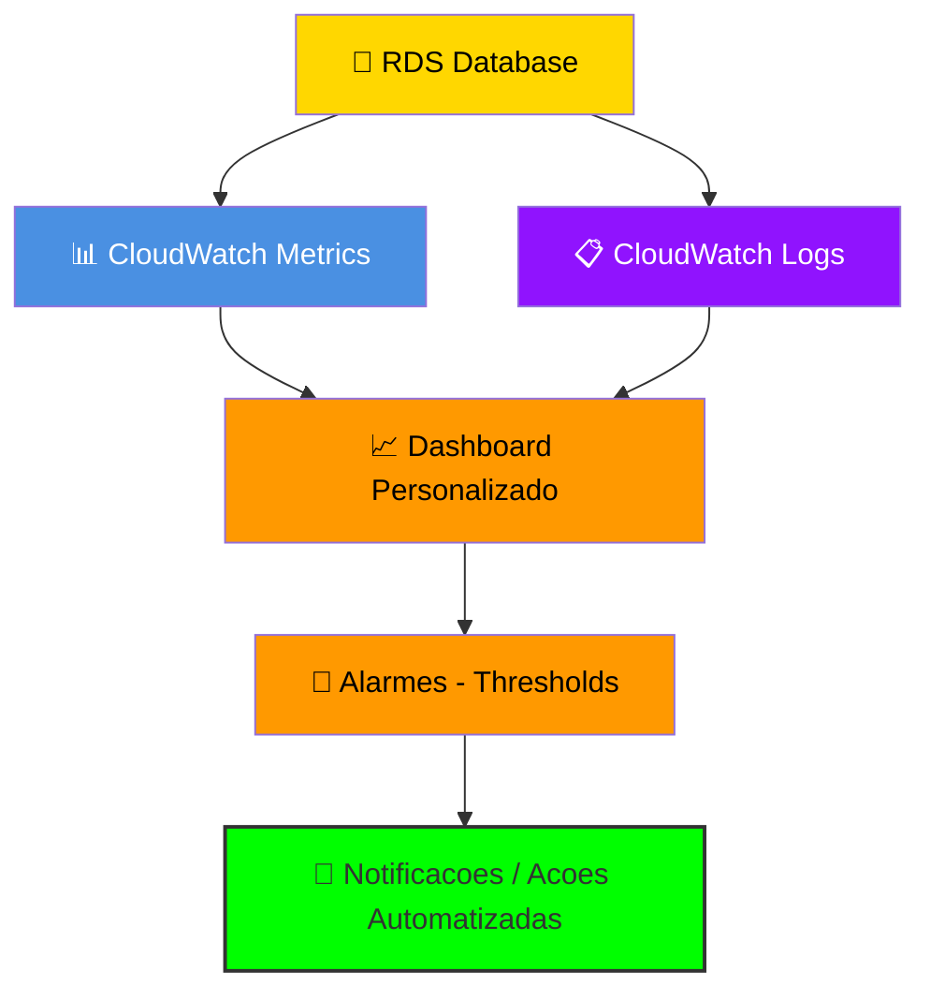

# Módulo 5 – Bancos de Dados na AWS

## 📌 Resumo
Neste módulo, aprendemos sobre **Amazon RDS**, **DynamoDB** e estratégias de **backup e recuperação de dados**. Entender bancos de dados na nuvem é essencial para criar aplicações confiáveis, escaláveis e seguras.

---

## 🗄️ Amazon RDS (Relational Database Service)

- **O que é RDS**: Banco de dados relacional totalmente gerenciado pela AWS.  
- **Benefícios**:  
  - Automação de backups e atualizações  
  - Alta disponibilidade com Multi-AZ  
  - Escalabilidade de armazenamento e computação  
- **Exemplo de uso**: MySQL, PostgreSQL ou SQL Server para aplicação web.  

---

## 🌐 Amazon DynamoDB

- **O que é DynamoDB**: Banco de dados NoSQL totalmente gerenciado, de alta performance e escalabilidade automática.  
- **Características**:  
  - Chave-valor e documentos  
  - Latência baixa e previsível  
  - Backup e restore automáticos  
- **Exemplo de uso**: Armazenamento de sessões de usuários ou dados de IoT em tempo real.  

---

## 💾 Estratégias de Backup e Recuperação de Dados

- **Backup**: Processo de salvar cópias dos dados para recuperação futura.  
- **Recuperação**: Restaurar dados em caso de falha, perda ou corrupção.  
- **Práticas recomendadas na AWS**:
  - Habilitar **automated backups** no RDS  
  - Criar **snapshots manuais** antes de atualizações críticas  
  - Utilizar **versionamento e replicação** no S3 e DynamoDB  
- **Exemplo prático**: Criar snapshot de RDS antes de atualizar instância e restaurar em caso de erro.

---

## 🎯 Dicas importantes

- Escolher **RDS para dados relacionais** e **DynamoDB para NoSQL**  
- Garantir que backups estejam em **outra região** para recuperação em desastres  
- Monitorar métricas com **CloudWatch** para antecipar problemas

## Backup e Restore (S3 e RDS)

> ✅ Explicação: A aplicação envia dados → backup automático → armazenamento durável → restauração → retorna para o banco/S3.

---

## DynamoDB Table

> ✅ Explicação: Fluxo de dados e eventos: app escreve/consulta → DynamoDB → eventos disparam Lambda → logs monitorados no CloudWatch.

---

## RDS Dashboard

> ✅ Explicação: Métricas e logs vão para o CloudWatch, que alimenta dashboards e aciona alarmes e notificações, refletindo melhor o monitoramento RDS.
> 

