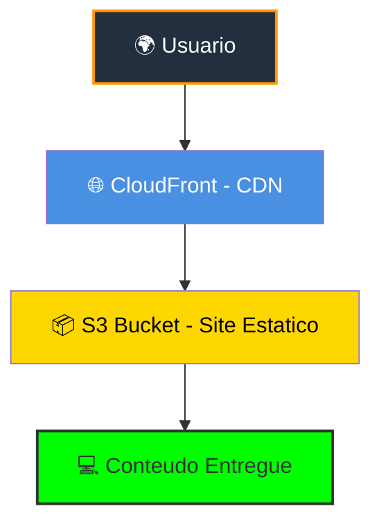
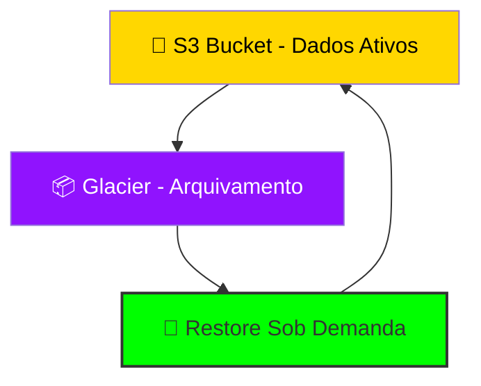

# Módulo 6 – Serviços de Armazenamento e CDN

## 📌 Resumo
Neste módulo, aprofundamos serviços de **armazenamento** e **distribuição de conteúdo** na AWS, incluindo **Amazon S3**, **Amazon Glacier** e **CloudFront**. Esses serviços são essenciais para armazenar dados de forma segura, econômica e distribuí-los globalmente com baixa latência.

---

## 🪣 Amazon S3

- **O que é**: Serviço de armazenamento de objetos escalável e durável.  
- **Uso principal**: Arquivos, backups, logs, conteúdo estático de sites.  
- **Classes de armazenamento**:
  - **Standard**: acesso frequente  
  - **Infrequent Access**: acesso raro  
  - **Glacier**: arquivamento de longo prazo, custo reduzido  
- **Exemplo prático**: Hospedar imagens e vídeos de um site estático.

---

## ❄️ Amazon Glacier

- **O que é**: Serviço de arquivamento de dados de longo prazo, com custo baixo.  
- **Usos principais**:
  - Backup histórico  
  - Arquivos raramente acessados  
  - Conformidade legal ou regulatória  
- **Exemplo prático**: Migrar logs antigos do S3 para Glacier para economia de custo.

---

## ☁️ Amazon CloudFront

- **O que é**: CDN (Content Delivery Network) da AWS para distribuição global de conteúdo.  
- **Benefícios**:
  - Reduz latência para usuários em diferentes regiões  
  - Aumenta disponibilidade do conteúdo  
  - Integração nativa com S3  
- **Exemplo prático**: Distribuir arquivos de um bucket S3 para usuários em todo o mundo via CloudFront.

---

## 🎯 Dicas importantes

- S3 é ótimo para armazenamento de objetos com acesso frequente  
- Glacier é ideal para **backup e arquivamento econômico**  
- CloudFront melhora performance de sites e APIs, combinando com S3 ou EC2

## Diagrama CloudFront + S3 (site estático ou distribuição de conteúdo)

>✅ Explicação: O usuário acessa o conteúdo por meio do CloudFront (CDN), que entrega arquivos com baixa latência. O conteúdo está armazenado em um S3 Bucket, onde ficam os arquivos estáticos (ex.: HTML, CSS, imagens, vídeos).

## Diagrama S3 + Glacier – Backup e Arquivamento

>✅ Explicação: O S3 armazena dados ativos que precisam estar disponíveis. Para reduzir custos, os arquivos menos acessados podem ser enviados para o Glacier (arquivamento de longo prazo). Quando necessário, o dado pode ser restaurado de volta ao S3. 

