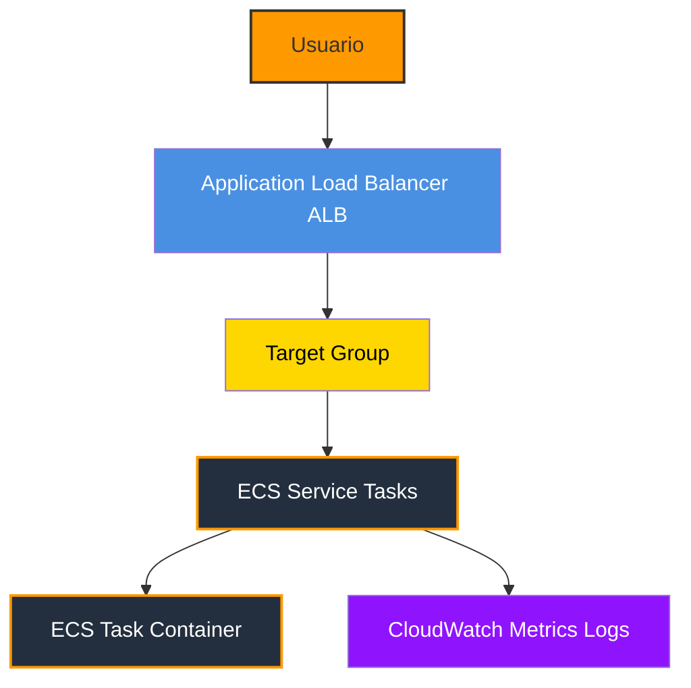
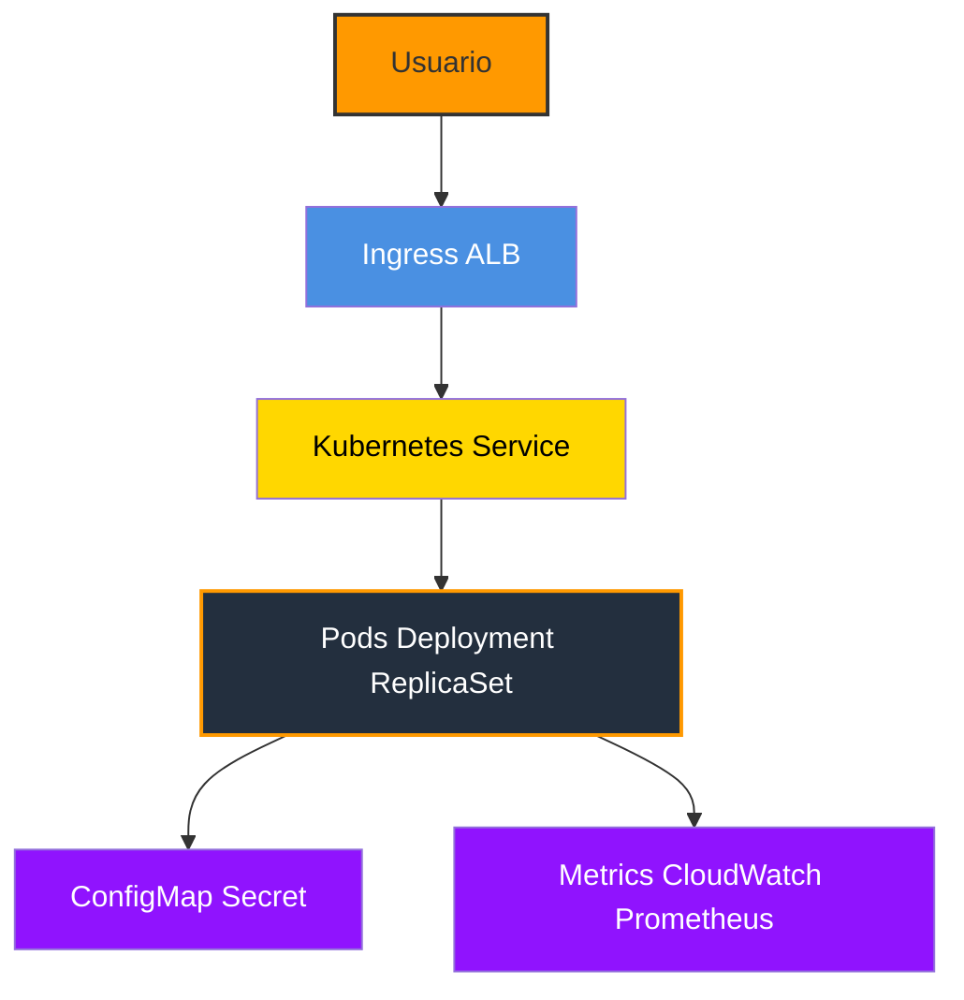
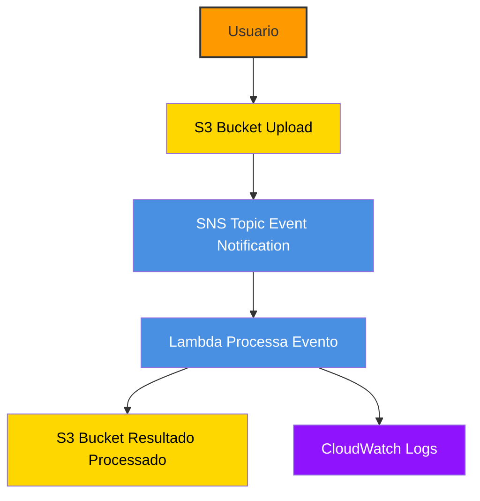
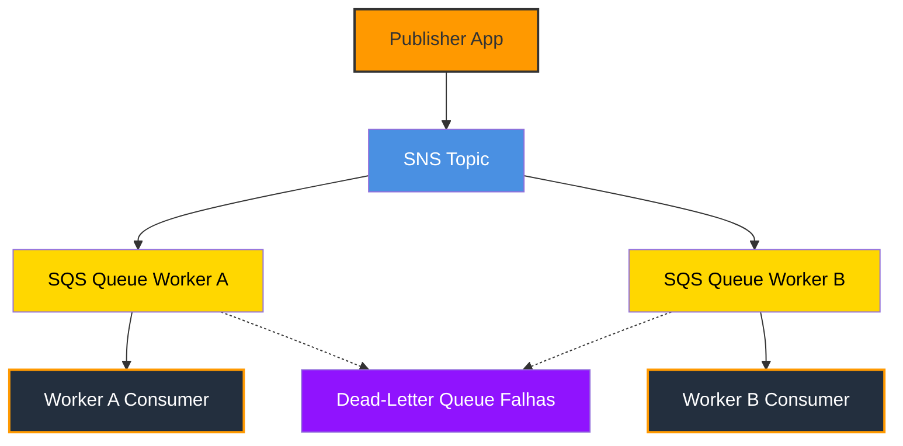

# Módulo 7 – Serviços Intermediários e Avançados

## Resumo
Neste módulo, aprofundamos serviços intermediários e avançados da AWS, incluindo **Lambda avançado**, **ECS**, **EKS**, **SNS** e **SQS**. O foco é entender **orquestração de containers**, **serverless avançado** e **comunicação assíncrona** entre sistemas.

---

## AWS Lambda Avançado

- **O que é**: Execução de código serverless, escalável automaticamente.  
- **Conceitos avançados**:
  - Triggers de eventos (S3, DynamoDB, API Gateway)  
  - Variáveis de ambiente para configuração  
  - Funções assíncronas e timeout configurável  
- **Exemplo prático**: Lambda que processa arquivos enviados para S3 e envia notificação via SNS

---

## Amazon ECS e EKS – Orquestração de Containers

- **ECS (Elastic Container Service)**: Serviço gerenciado para executar containers Docker.  
- **EKS (Elastic Kubernetes Service)**: Kubernetes totalmente gerenciado na AWS.  
- **Diferenças ECS vs EKS**:
  - ECS: mais simples, integração nativa com AWS  
  - EKS: mais flexível, compatível com Kubernetes padrão  
- **Exemplo prático**: Deploy de uma aplicação web em ECS com 2 containers e balanceamento via ALB

---

## Amazon SNS e SQS – Comunicação Assíncrona

- **SNS (Simple Notification Service)**:
  - Serviço de pub/sub para enviar notificações em tempo real  
  - Exemplo: Enviar email ou SMS quando um arquivo é enviado ao S3
- **SQS (Simple Queue Service)**:
  - Fila de mensagens para desacoplar aplicações  
  - Exemplo: Colocar pedidos de processamento em fila para Lambda consumir

---

## Diagrama ECS + ALB

> Explicação: Usuários chegam pelo Application Load Balancer (ALB); o ALB encaminha para o target group do serviço ECS (tasks/container instances). O serviço ECS escala tasks e envia logs/metrics para CloudWatch.

## Diagrama Kubernetes + Ingress/ALB

> Explicação: Usuários chegam pelo Ingress (ou ALB equivalente); o Ingress encaminha para o Kubernetes Service, que gerencia Pods (via Deployment/ReplicaSet). Pods usam ConfigMaps/Secrets e enviam métricas para CloudWatch.

## Diagrama S3 -> SNS -> Lambda -> S3 (Processamento de upload)

> Explicação: Usuário sube um arquivo no S3; S3 emite um evento para um SNS Topic (ou SNS via Event Notification); o SNS notifica uma Lambda (assinatura); a Lambda processa o arquivo e grava resultado em outro S3 (ou mesma bucket/prefix). Logs vão para CloudWatch.

## Diagrama SNS -> SQS (fanout / desacoplamento)

> Explicação: Um produtor publica mensagens em um SNS Topic; o SNS encaminha (fan-out) para uma ou mais SQS queues (subscriptions). Consumidores/workers leem da SQS de forma assíncrona. Incluí uma Dead-Letter Queue (DLQ) para mensagens que falham repetidamente.

---

## 🎯 Dicas importantes

- Usar Lambda para tarefas event-driven e processamento serverless  
- ECS para aplicações containerizadas que precisam de gerenciamento simplificado  
- EKS quando já se domina Kubernetes ou precisa de portabilidade  
- SNS + SQS garantem comunicação confiável e escalável entre sistemas

